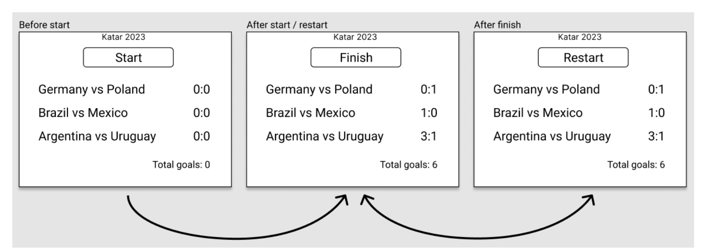

## Requirements
1) User should be able to start, finish and restart the simulation.
2) Each simulation has a name (e.g. “Katar 2023”)
3) Each simulation takes 90 seconds (unless manually finished by the user before 90 seconds elapses).
4) Before 90 seconds elapses user can manually finish the simulation. If simulation hasn’t been manually finished, it’s automatically
stopped after 90 seconds.
5) Every 10 seconds random team scores exactly 1 goal. First goal is scored at the 10th second, last goal is scored at the 90th second
6) When the simulation is finished, user can restart it. Then the results are reset and the simulation starts again.

## Wireframe

